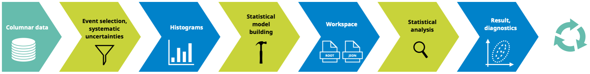

# Analysis Grand Challenge (AGC)

The Analysis Grand Challenge (AGC) is about performing the last steps in an analysis pipeline at scale to test workflows envisioned for the HL-LHC.
This includes

- columnar data extraction from large datasets,
- processing of that data (event filtering, construction of observables, evaluation of systematic uncertainties) into histograms,
- statistical model construction and statistical inference,
- relevant visualizations for these steps,

all done in a reproducible & preservable way that can scale to HL-LHC requirements.

The AGC has two major pieces:

1) **specification of a physics analysis** using Open Data which captures relevant workflow aspects encountered in physics analyses performed at the LHC,
2) a **reference implementation** demonstrating the successful execution of this physics analysis at scale.

The physics analysis task is a $t\bar{t}$ cross-section measurement with 2015 CMS Open Data (see `datasets/cms-open-data-2015`).
The current reference implementation can be found in `analyses/cms-open-data-ttbar`.
In addition to this, `analyses/atlas-open-data-hzz` contains a smaller scale $H\rightarrow ZZ^*$ analysis based on ATLAS Open Data.

See [this talk given at ICHEP 2022](https://agenda.infn.it/event/28874/contributions/169204/attachments/94615/129603/20220709_AGC_ICHEP.pdf) for some more information about the AGC.
Additional information is available in two workshops focused on the AGC:

- [IRIS-HEP AGC Tools 2021 Workshop, Nov 3–4 2021](https://indico.cern.ch/e/agc-tools-workshop)
- [IRIS-HEP AGC Tools 2022 Workshop, April 25–26 2022](https://indico.cern.ch/e/agc-tools-2)

We also have a [dedicated webpage](https://iris-hep.org/grand-challenges.html).

## AGC and IRIS-HEP

The AGC serves as an integration exercise for IRIS-HEP, allowing the testing of new services, libraries and workflows on dedicated analysis facilities in the context of realistic physics analyses.

## AGC and you

We believe that the AGC can be useful in various contexts:

- testbed for software library development,
- realistic environment to prototype analysis workflows,
- functionality, integration & performance test for analysis facilities.

We are very interested in seeing (parts of) the AGC implemented in different ways!
Besides the implementation in this repository, have a look at

- a ROOT RDataFrame-based implementation: [andriiknu/RDF/](https://github.com/andriiknu/RDF/),
- a pure Julia implementation: [Moelf/LHC_AGC.jl](https://github.com/Moelf/LHC_AGC.jl).

Please get in touch if you have investigated other approaches you would like to share!
There is no need to implement the full analysis task — it splits into pieces (for example the production of histograms) that can also be tackled individually.

## More details: what is being investigated in the AGC context

- New user interfaces: Complementary services that present the analyst with a notebook-based interface.  Example software: Jupyter.
- Data access: Services that provide quick access to the experiment’s official data sets, often allowing simple derivations and local caching for efficient access.  Example software and services: Rucio, ServiceX, SkyHook, iDDS, RNTuple.
- Event selection: Systems/frameworks allowing analysts to process entire datasets, select desired events, and calculate derived quantities.  Example software and services: Coffea, awkward-array, func_adl, RDataFrame.
Histogramming and summary statistics: Closely tied to the event selection, histogramming tools provide physicists with the ability to summarize the observed quantities in a dataset.  Example software and services: Coffea, func_adl, cabinetry, hist.
- Statistical model building and fitting: Tools that translate specifications for event selection, summary statistics, and histogramming quantities into statistical models, leveraging the capabilities above, and perform fits and statistical analysis with the resulting models.  Example software and services: cabinetry, pyhf, FuncX+pyhf fitting service
- Reinterpretation / analysis preservation:  Standards for capturing the entire analysis workflow, and services to reuse the workflow which enables reinterpretation.  Example software and services: REANA, RECAST.

## Acknowledgements

This work was supported by the U.S. National Science Foundation (NSF) cooperative agreement [OAC-1836650 (IRIS-HEP)](https://nsf.gov/awardsearch/showAward?AWD_ID=1836650).
