:math:`t\bar{t}` Analysis Background
===============================================================
The section covers the different components of the :math:`t\bar{t}` analysis using `2015 CMS Open Data <https://cms.cern/news/first-cms-open-data-lhc-run-2-released>`_ (see :ref:`versions-description` section for more information). 
Here is an overview of what is covered in this page:

#. Brief description of the input data.
#. Event selection criteria and description of the signal event signature.
#. Event weighting.
#. Method for reconstructing the top mass
#. Statistical model building and fitting
#. Machine learning component in which jets are assigned to parent partons.

1. Input
---------------------------------------------------------------
Input data is five sets of ``ROOT``-files. 
Each set is produced in MC simulation and represents a partial interaction channel, one of five: **ttbar**-channel, **single top s**-channel, **single top t**-channel, **single top tW**-channel, **Wjets**-channel. 
The ``ROOT``-file structure can be represented as a schematic:

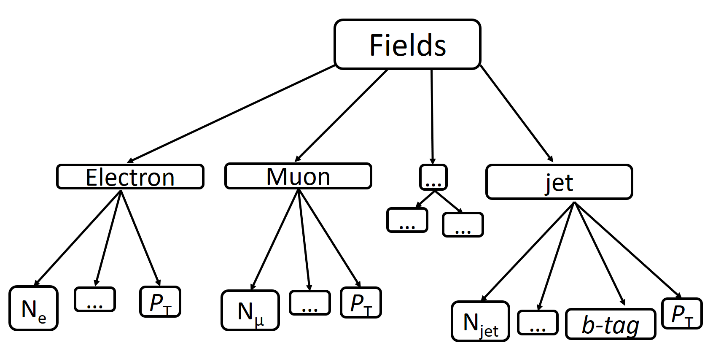

This diagram shows only those fields that will be required for further analysis, such as electron, muon, and jet. 
Each of these branches has its number of particles (:math:`N_e`, :math:`N_{\mu}`, :math:`N_{jet}`), the transverse momentum value (:math:`p_T`) that will be used in the following sections for events filtering. 
Also, jets have a b-tag value, which is the output of a discriminator used to identify b-jets (jets produced by b-quark).

The analysis task involves selecting events from the input dataset in which measured quantities originate from :math:`t\bar{t}` decay. 
In real data, one cannot know with 100\% certainty that an event comes from a specific process, including :math:`t\bar{t}` decay. Through our simulated data, we can ascertain the truth information of each event, which provides us extra tools to develop our analysis. 
Our data is separated by file into five channels: ``ttbar``, ``single_top_s_chan``, ``single_top_t_chan``, ``single_top_tW``, and ``wjets``).
  
2. Event Selection
---------------------------------------------------------------
Not all event information is needed for this analysis. 
The only objects to which selection criteria will be applied are leptons (electrons and muons) and jets that are the products of :math:`t\bar{t}` decay. 
In the semi-leptonic decay channel of :math:`t\bar{t}` production, two jets, two b-jets, and one lepton are expected, as can be concluded from the diagram below:

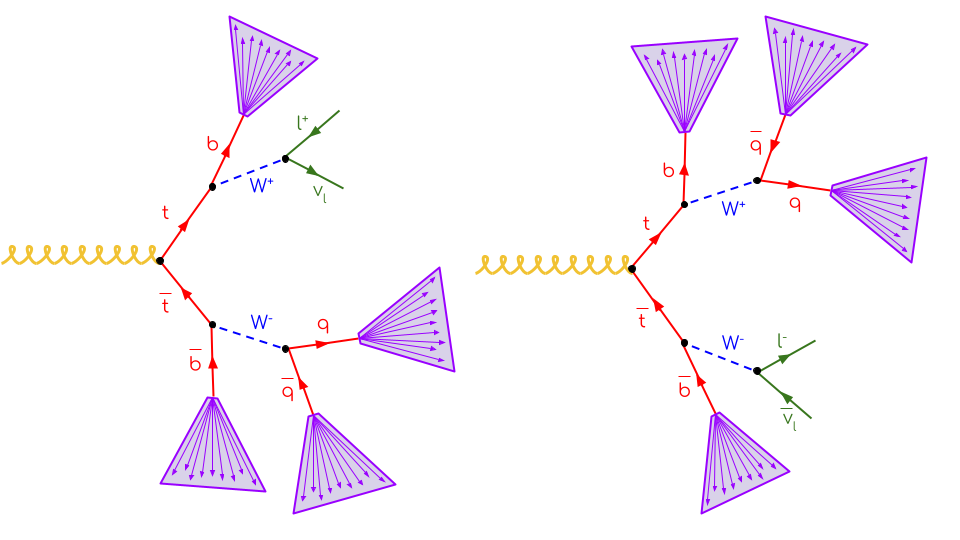

Here is an example of the above signature in CMS Open Data. 
Since this is Monte Carlo simulated data, we can look at the particles that the jets originate from. 
The jets are plotted as circles in the :math:`\eta`-:math:`\phi` plane, and color-coordinated with the truth particles they are matched to. Note that :math:`\phi` is a circular variable, so the top of the graph matches to the bottom. 
The jets that are outlined in solid black are b-tagged, which means that they have properties which strongly indicate that they originate from bottom quarks.

To look at more events, take a look at the notebook plotEvents_.

.. _plotEvents: event-plotting/plotEvents.ipynb

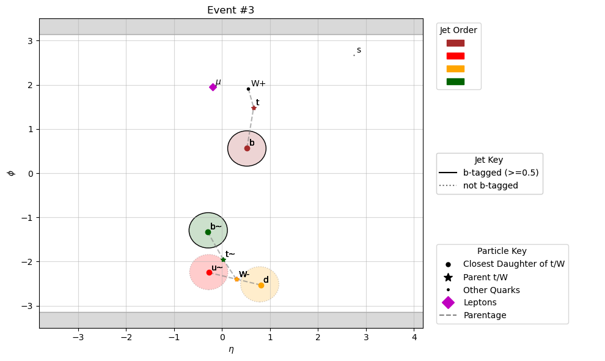
  
The tree of the above event looks something like

.. code-block:: text

    g
    ├── t
    │   ├── W+
    │   │   ├── mu+
    │   │   └── nu(mu)
    │   └── b
    └── t~
        ├── W-
        │   ├── s
        │   └── c~
        └── b~
        
To ensure that we retain the highest possible purity of :math:`t\bar{t}` events in the signal region, we make the following cuts:

* Events must contain exactly one lepton, which must have :math:`p_T>30` GeV, :math:`|\eta|<2.1`, and ``sip3d<4`` (significance of 3d impact parameter)
* Jets must have :math:`p_T>30` GeV and :math:`|\eta|<2.4` and satisfy a tight lepton veto (``isTightLeptonVeto``, or ``jetId==6``)
* Events must have at least four jets
* Events must have exactly one :math:`b`-tagged jet

There are a few more details about the cuts, which one can read about in :ref:`versions-cuts`.

3. Weighting
---------------------------------------------------------------
The above-described algorithm assumes that data samples generated using different channels come into the histogram with equivalent weights. 
This is not the case, as the relative number of events in each sample does not reflect the rate at which that process occurs in our detected events. 
So we need to account for the cross-section when processing events. This is the formula for calculating weights:

.. math::
    
    w_i = {{\sigma}_i L \over N_i}

where :math:`i` represents the partial interaction channel, :math:`\sigma` is the partial cross-section, :math:`L` is the luminosity, and :math:`N_i` is the total number of events in the data sample.

The luminosity for this dataset is :math:`L=3378\;pb^{-1}`.

The cross-section values used are listed below (obtained from `this site <https://twiki.cern.ch/twiki/bin/view/LHCPhysics/LHCTopWG>`_):

.. list-table:: Cross-section values
   :widths: 50 50
   :header-rows: 1

   * - Process
     - Cross-section [pb]
   * - ``ttbar``
     - 729.84
   * - ``single_top_s_chan``
     - 6.839
   * - ``single_top_t_chan``
     - 214.2
   * - ``single_top_tW``
     - 79.3
   * - ``wjets``
     - 61526.7 * 0.253
     
     
4. Observables to Calculate
---------------------------------------------------------------
The below table gives an overview of the observables and their binning.

.. list-table:: Histogram Observables
   :widths: 25 15 30 30
   :header-rows: 1

   * - Region
     - Name
     - Binning (Processing Step)
     - Binning (Statistical inference)
   * - 4j2b (Control Region)
     - :math:`H_T`
     - 25 bins from 50 GeV to 550 GeV
     - 11 bins from 110 GeV to 550 GeV
   * - 4j1b (Signal Region)
     - :math:`m_{bjj}`
     - 25 bins from 50 GeV to 550 GeV
     - 11 bins from 110 GeV to 550 GeV

25 bins should be used for histogram production.
The statistical model should be built with less bins and a different lower bin edge for the histograms.
This simulates a scenario where analyzers may want to evaluate their model with a finer granularity but subsequently merge bins for inference to avoid statistical fluctuations.

**4j2b (Control Region)**: Event :math:`H_T`

In the control region, we require there to be at least two b-tagged jets (``btagCSVV2 > B_TAG_THRESHOLD``:sup:`*`) and at least four jets.

The observable in this region is the event :math:`H_T`, which is the sum of the :math:`p_T` of all jets in each event.

**4j1b (Signal Region)**: :math:`m_{bjj}` (Reconstructed top mass)

In the signal region, we require there to be exactly one b-tagged jet (``btagCSVV2 > B_TAG_THRESHOLD``:sup:`*`) and at least four jets.

To measure the :math:`t\bar{t}` cross-section, we use an observable that approximately reconstructs the top quark mass.
This is done using the following steps:

#. Filter the events using the criteria explained above (including requiring at least four jets and exactly one lepton)
#. Calculate all possible combinations of three jets from all jets in each event (for example, in our implementation we use ``ak.combinations``)
#. Ensure that there is at least one b-tagged jet 
#. Choose the combination with the largest combined transverse momentum (:math:`p_T`)
#. Calculate combined mass of trijet system

:sup:`*` **NOTE:** All jets have an associated ``btagCSVV2`` value, ranging from 0 to 1, which quantifies how likely the jet is come from a b quark. We utilize a threshold value, ``B_TAG_THRESHOLD=0.5``, to accept a jet as "b-tagged".

Successful top mass reconstruction can be inferred from the below histogram, which is peaked around the top mass (:math:`\approx 173 GeV`). 
We can also see that our selection criteria worked, since the majority of events in the histogram are from the :math:`t\bar{t}` sample.

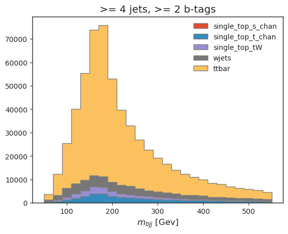

5. Systematic Uncertainties
---------------------------------------------------------------
This section explains how to calculate the various systematic uncertainties we incorporate into our model. Some of these affect the kinematics of the event, so the observables will need to be calculated for each variation. Note that one-sided variations must be symmetrized.

.. list-table:: Systematic Uncertainties
   :widths: 20 20 20 40
   :header-rows: 1

   * - Name
     - Type
     - Where to apply
     - Formula
   * - ``pt_scale``
     - Jet kinematics variation
     - All nominal samples
     - Scale jet :math:`p_T` up and down by 3\%
   * - ``pt_res``
     - Jet kinematics variation
     - All nominal samples
     - Scale jet :math:`p_T` by randomly generated values (normal distribution with :math:`\mu=1.0`, :math:`\sigma=0.05`) 
   * - ``btag_var_i``
     - Event weight variation
     - All nominal samples (when populating histograms)
     - Scale the weight of the event by 7.5\% of the ``i``-th jet :math:`p_T` divided by 50 (for the four leading jets, :math:`i\in\{1,2,3,4\}`).
   * - ``scale_var``
     - Event weight variation
     - **W + jets** nominal sample
     - Scale the weight of the event up and down by 2.5\%.
   * - Luminosity
     - Normalization variation
     - Histograms (after creation)
     - Vary normalization up and down by 3\%
   * - ME variation
     - :math:`t\bar{t}` variation
     - :math:`t\bar{t}` sample
     - replace ``ttbar__nominal`` input files with ``ttbar__ME_var`` files (one-sided variation)
   * - PS variation
     - :math:`t\bar{t}` variation
     - :math:`t\bar{t}` sample
     - replace ``ttbar__nominal`` input files with ``ttbar__PS_var`` files (one-sided variation)
   * - :math:`t\bar{t}` scale variation
     - :math:`t\bar{t}` variation
     - :math:`t\bar{t}` sample
     - replace ``ttbar__nominal`` input files with ``ttbar__scaleup`` and ``ttbar__scaledown`` files

6. Statistical Model
---------------------------------------------------------------
The following description details building a statistical model in the ``HistFactory`` format. This format is documented in the `ROOT documentation <https://root.cern/doc/master/group__HistFactory.html>`_ and the `pyhf documentation <https://pyhf.readthedocs.io/en/latest/intro.html#histfactory>`_.

We want to develop a statistical model, parameterized by some physical parameters :math:`\vec{\alpha}`. 
We have one parameter of interest, the :math:`t\bar{t}` cross-section, and a handful of *nuisance parameters*, which are physics parameters that are not of interest in this analysis. 
Changing any nuisance parameter can have an effect on the expected rate of a physics process and/or distribution shapes, leading to systematic uncertainties. 
In general, we model the effects of changing nuisance parameters by generating Monte Carlo realizations for different variations of parameters. 
Once we have these, we can utilize different interpolation strategies to construct a continuous parameterization. 

Generally, and inclusive of this analysis example, we consider three different variations: one "nominal" parameter setting, where the nominal setting is chosen based on previous experience and studies, one "up" sample, where the parameter is increased by :math:`1\sigma`, and one "down" sample, where the parameter is decreased by :math:`1\sigma`. 
The standard uncertainties of the parameters often originate from auxiliary measurements, which necessitate the inclusion of additional constraint terms in the statistical model. 
Using the up/nominal/down measurements, an interpolation can be made (for each bin) so that a model prediction can be provided for any parameter value:

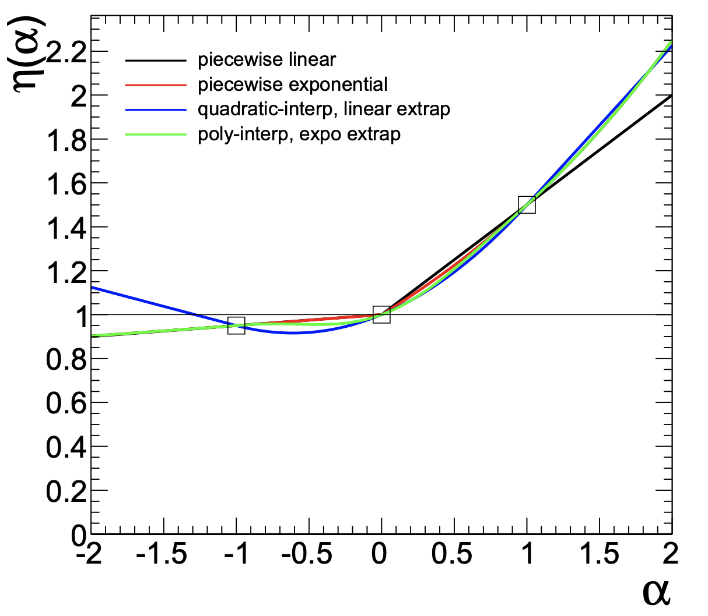
 
The above example was obtained from `CERN-OPEN-2012-016 <https://cds.cern.ch/record/1456844>`_.

In order to perform a fit with this model, we construct some pseudodata from our Monte Carlo samples. In a real analysis, real data would be used in place of pseudodata, but this substitution has no effect on our purpose, which is demonstrating the technical workflow of a physics analysis. The formula we use for the pseudodata construction uses the Matrix Element (ME) and Parton Shower (PS) variations of :math:`t\bar{t}` as well as the W + jets and t-channel single top samples::

    pseudo_data = (all_histograms[:, :, "ttbar", "ME_var"] + all_histograms[:, :, "ttbar", "PS_var"]) / 2  + all_histograms[:, :, "wjets", "nominal"] + all_histograms[:, :, "single_top_t_chan", "nominal"]

Using our pseudodata, we run a maximum likelihood fit over all parameters to find the best-fit parameter values. The fit balances a trade-off between altering the model values to agree with the data and keeping the nuisance parameters as close to the nominal values as possible.

The results of this fit can be seen in the below diagram, which demonstrates how far each parameter was pulled from its nominal value:

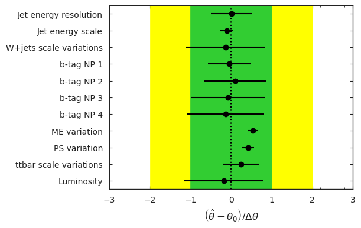

Here is what the model looks like, before and after the fit is performed:

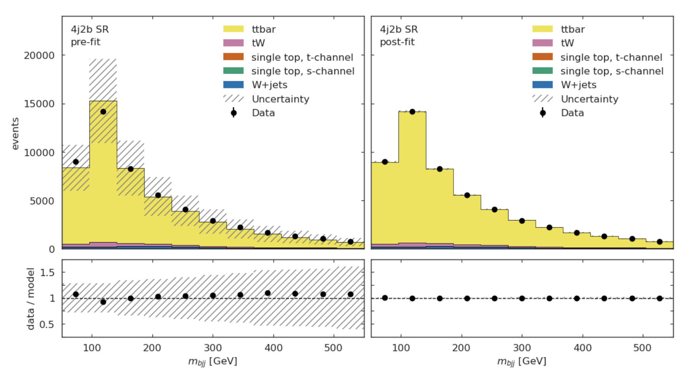

For more information to statistics in LHC physics, visit `this document <https://arxiv.org/abs/1503.07622>`_.

7. Machine Learning Component
---------------------------------------------------------------
Most modern high energy physics analyses use some form of machine learning (ML), so a machine learning task has been incorporated into the AGC :math:`t\bar{t}` cross-section measurement to reflect this development. 
The method described above to reconstruct the top mass attempts to correctly select all three jets on the hadronic side of the collision. 
Using ML, we can go beyond this task by attempting to correctly assign each jet with its parent parton. 
This should allow for a more accurate top mass reconstruction as well as access to new observables, such as the angle between the jet on the leptonic side of the collision and the lepton, or the angle between the two W jets.
For the IRIS-HEP implementation of this task, to enable machine learning in the ttbar analysis notebook, one must set ``USE_INFERENCE = True``. 

The strategy used for this jet-parton assignment task is as follows:

In each event, we want to associate four jets to three labels. 
We want to label two jets as :math:`W` (considering these two to be indistinguishable), one jet as :math:`b_{top-had}` (the top jet on the side of hadronic decay), and one as :math:`b_{top-lep}` (the top jet on the side of leptonic decay). 
This is visualized in the diagram below:

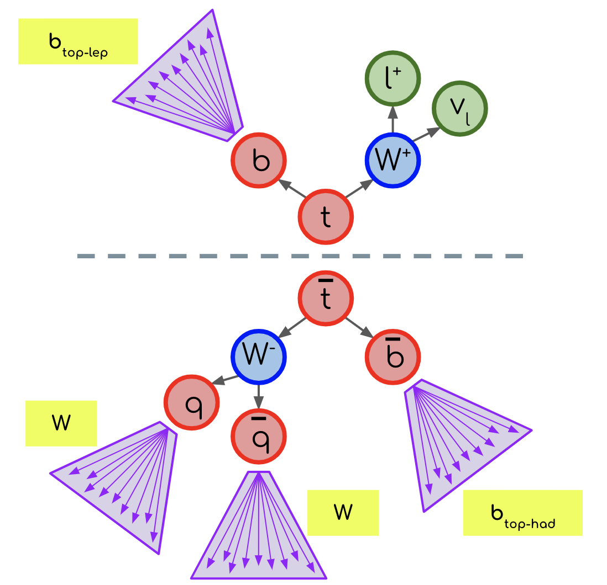
  
In each event, we consider each permutation of jets assigned to these labels, restricting to the leading (in :math:`p_T`) :math:`N` jets. 
The number of such permutations (assuming the event has at least :math:`N` jets and that :math:`N\geq 4`) is :math:`N!/(2\cdot (N-4)!)`. 
For example, if there are 4 jets in an event, we consider :math:`4!/2=12` permutations. 
The :math:`4!` comes from labelling 4 jets, while dividing by 2 accounts for the fact that two of the jets are labelled indistinguishably. 
If there are more than 4 jets, the remainder are assigned to a fourth category, "other". Jets are also assigned to this category indistinguishably. 
For example if :math:`N=7` and we have 7 jets in an event, we consider :math:`7!/(2\cdot 3!)=420` permutations, since we assign labels to 7 jets. 
We assign 2 jets to "W" indistinguishably, then the three remainder to "other" indistinguishably.

To vizualize the :math:`N=4` scenario, view the diagram below:

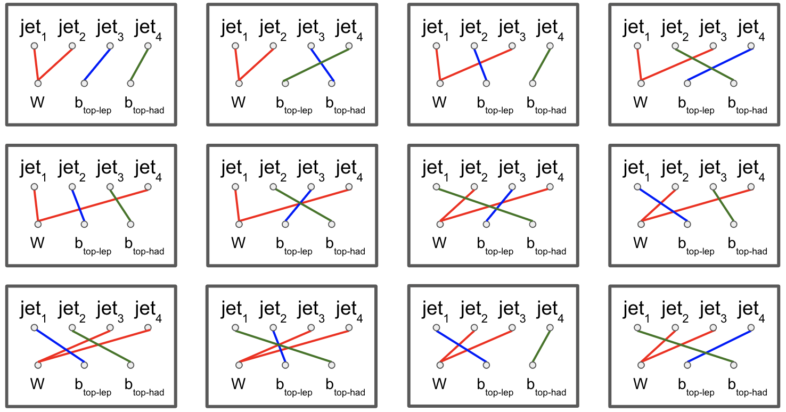
  
For each permutation, we calculate 20 features:

#. :math:`\Delta R` between the :math:`b_{top-lep}` jet and the lepton
#. :math:`\Delta R` between the two :math:`W` jets
#. :math:`\Delta R` between the first :math:`W` jet and the :math:`b_{top-had}` jet
#. :math:`\Delta R` between the second :math:`W` jet and the :math:`b_{top-had}` jet (should have same distribution as previous feature)
#. Combined mass of the :math:`b_{top-lep}` jet and the lepton
#. Combined mass of the two :math:`W` jets
#. Combined mass of the two :math:`W` jets and the :math:`b_{top-had}` jet (reconstructed top mass)
#. Combined :math:`p_T` of the two :math:`W` jets and the :math:`b_{top-had}` jet
#. :math:`p_T` of the first :math:`W` jet
#. :math:`p_T` of the second :math:`W` jet (should have same distribution as previous feature)
#. :math:`p_T` of the :math:`b_{top-had}` jet
#. :math:`p_T` of the :math:`b_{top-lep}` jet
#. ``btagCSVV2`` of the first :math:`W` jet (:math:`b`-tag value)
#. ``btagCSVV2`` of the second :math:`W` jet (should have same distribution as previous feature)
#. ``btagCSVV2`` of the :math:`b_{top-had}` jet
#. ``btagCSVV2`` of the :math:`b_{top-lep}` jet
#. ``qgl`` of the first :math:`W` jet (quark-gluon discriminator)
#. ``qgl`` of the second :math:`W` jet (should have same distribution as previous feature)
#. ``qgl`` of the :math:`b_{top-had}` jet
#. ``qgl`` of the :math:`b_{top-lep}` jet

For each permutation, all 20 features are fed into a boosted decision tree, which was trained to select correct permutations. 
After this, the permutation with the highest BDT score is selected as "correct", then we use those jet-parton assignments to calculate the observables of interest.

It is a future goal to move onto a more sophisticated architecture, as the BDT method is restrictive since it becomes computationally expensive for events with high jet multiplicity.

BDT Performance
---------------------------------------------------------------
The results in this section are specific to the models provided in the `repository <https://github.com/iris-hep/analysis-grand-challenge/tree/main/analyses/cms-open-data-ttbar/models>`_. The results will differ some with each model-training.

We can first qualitatively compare the top mass reconstruction by the trijet combination method and the BDT method by comparing their distributions to the truth top mass reconstruction distribution. 
The events considered here are those in which it is possible to correctly reconstruct all jet-parton assignments in the leading four jets.

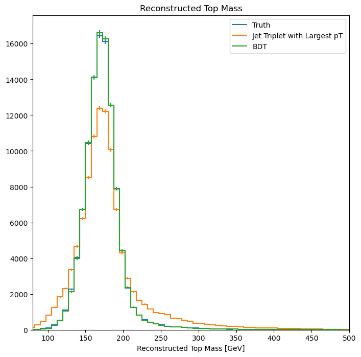
  
We can see that the result from using the BDT method (green) more closely matches the truth distribution (blue) than the trijet combination method (orange).

If we look into the performance by calculating which jet-parton assignments are predicted correctly, we also see that the BDT method performs better. 
If we look at the top 6 jets in each event and restrict the set of events to those in which full reconstruction is possible (i.e. all truth labels are present in the top 6 jets), we see that the BDT selects the correct three jets for the top mass reconstruction 60.10% of the time, while the trijet combination method only selects the correct three jets 28.31% of the time.

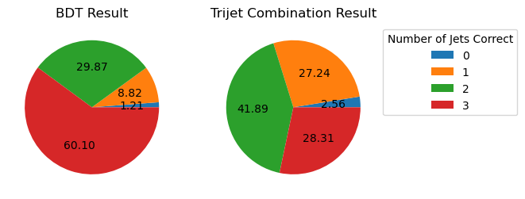
  
The BDT is also trying to predict more information than the trijet combination method. 
Instead of finding the three correct jets to use for the reconstructed mass, we want to choose correct labels for four jets in an event. So to ensure that the BDT is performing as it should, we can compare BDT output to random chance. 
If we again look at the top 6 jets in each event and restrict the set of events to those in which full reconstruction is possible, we see the following:

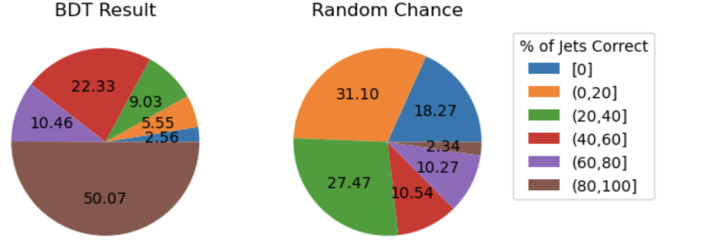

The BDT does much better than random chance at predicting jet-parton assignments.

Document Authors
---------------------------------------------------------------

* `Andrii Falko <https://github.com/andriiknu>`_
* `Elliott Kauffman <https://github.com/ekauffma>`_
